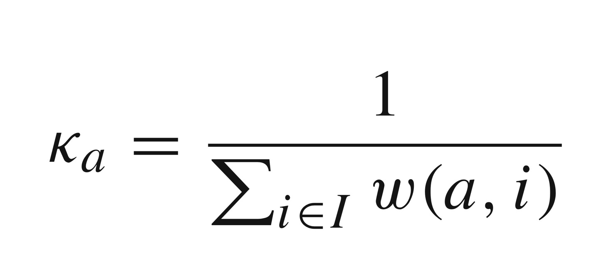

# Time to CARE : a collaborative engine for practical disease prediction   

## Abstract   
* CARE   
    * 환자들의 의료 기록을 활동해 환자들의 병 예측   
    * Collaborative filtering 사용하여 개인 의료 기록과 비슷한 환자들의 병을 예측   

* ICARE
    * Iterative version   
    * 향상된 성능을 위한 앙상블 개념을 통합   
    * Apply time-sensitive modifications   

## Introduction   
* 현재의 의료는 선제적 치료가 아니라 질병의 증상이 나타나면 즉시 개입하여 초기 징후에 질병을 치료하는 사후적 치료   
* genome revolution에 의해 이점을 보고 있으나 단점도 존재   
* phenotype : 표현형(表現型, phenotype) 또는 발현형질(發現形質)은 생명학에서, 생명체가 유전적인 정보를 이용하여, 세포, 조직 및 개체에 단백질과 당을 통해 생산한 기능적 형질   
* 본 논문의 목표는 표현형과 질병 이력 기반 접근이 질병 예측에 탁월하다는 것을 보여주는 것 :smiley:   
   

### Contribution   
* Collaborative filtering methodology   
* Each user is a patient whose profile is a vector of diagnosed diseases(진단 병명).   
* Ratings = Binary (환자가 병이 있으면 1, 없으면 0), 음악과 영화와 달리 유저가 선택하는 것이 아님   
1. International classification of Disease code를 사용한다.   
2. 사용된 협업 필터링 방법은 이전 작업을 기반으로 하며 CARE 내에서 의미 테스트 및 앙상블 방법의 새로운 요소를 통합   
3. A time sensitive   

   
## Data   
* Input : 각 환자의 방문 마다의 질병 이력 ICD-9 코드   
* 각 데이터 기록은 환자 ID로 표시되는 병원 방문과 방문당 최대 10개의 진단 코드 목록으로 구성   
* num of visit range 1~255  

## The CARE Methodology   
### System Overview   
* Testing patient (denoted as $a$), Training patients (denoted as $I$, individuals $i$)   
* Training set은 협력 필터링을 적용하기 전에 테스트 환자와 공통된 질병이 두 개 이상 있는 환자로 제한    
    * Test patient a 와 가장 비슷한 group of patients가 모이게 된다.   
* 이후 collaborative filtering 적용, ICARE의 경우 각 환자마다 multiple times를 하여 각 질병에 매번 different training patient group을 만든다. 다수의 결과 예측은 앙상블을 형성하기 위한 것이다.   
* Output은 ranked list   
   
### Vector Similarity   
#### 1. 용어 정리   
* $p(a, j)$ : $a$가 disease(item) $j$를 사용할, 가질 예측값   
* $a$ = active user(testing), every other user $i$ (previously given a vote $v_i,_j$ for item $j$)   
* $I$ = The entire training set of users, $I_j$ = the subset of users who've voted on $j$   
* $w(a, i)$ : vector similarity btw users $a$ and $i$   
#### 2. $w(a, i)$   
   
- $a$와 $i$가 얼마나 비슷한지 측정한다.   
    cf. 코사인 유사도는 두 벡터 간의 코사인 각도를 이용하여 구할 수 있는 두 벡터의 유사도를 의미, 두 벡터의 방향이 완전히 동일한 경우에는 1의 값을 가지고, 90도의 각을 이루면 0의 값, 180도로 반대의 방향을 가지면 -1의 값을 가진다. 즉, -1 이상 1이하의 값을 가지며 값이 1에 가까울수록 유사도가 높다고 판단   
#### 3. $p(a, j)$   
   
- 기존 방정식에서 이진 진단(0,1)을 통합하고 ratings 범위의 effect를 제거하기 위해서 수정   
- $\bar{v}_j$ : 질병의 random expectation   
    $\bar{v}_j$ = $\vert I_j\vert\over \vert I\vert$   
    = 전체 training set of users 중 병을 가지고 있는 비율   

   
- normalizing constant   
- random expectation $\bar{v}_j$가 baseline expectation이 되고 다른 사람들 중 j를 가진 유사도를 바탕으로 추가적인 risk를 더한다.   
### Inverse Frequency   
또한 초반에 등장하였던 $w(a, i)$를 확장시켜서 IF를 추가하였다. Rare disease에 대한 가중치를 더 높이 주기 위함 (즉, common disease에 대한 가중치를 lower하기 위함임)   
* $f_j$ = $log$ $n\over n_j$   
    - The inverse frequency of disease $j$   
    - $n$ = num of patients in the training set   
    - $n_j$ = j를 가진 환자의 수   
   

### Grouping of training patients  
* 협업 필터링 이전에 testing patient들과 같은 증상이 있는 관련 training patients group을 결정한다.   
* 성능이 좋아진다.   
* Random expectation of disease $\neq$ Overall occurrence   
* Global expectation $\bar{v_j}$, with a group c, $\bar{v_j,_c}$   

### ICARE with ensembles :star::star::star:    
* Why ensembles? 다른 질병의 노이즈로부터 최대한 방해를 덜 받기 위해서   
* 환자 $a$에 대한 질병 $j$에 대해서 training patients를 통해 협업 필터링을 진행한다. 
* 각 질병은 개별적으로 강력한 영향을 미칠 기회가 있지만 모든 질병 상호 작용은 보존, 각 질병에 대한 최대 예측 점수를 취하여 앙상블을 결합   

   
* $G$ = set of ensemble members or disease groups   
* $max$를 이용하는 이유는 추가적인 질병을 갖는다고 심화되는 질병 확률을 낮추지 않기 때문   
* ${v_j,_c}$가 $\bar{v}_j$보다 높은 것만 예측하도록 함   
    * 질병의 유행이 focused group보다 전 인구에서 더 높다면, group이 그 질병($j$) 발병에 강력한 영향을 주지 않으므로   
* 질병의 중요성은 difference of proportions test를 통해 결정   
    * 두 그룹의 차이를 봐서 결정하겠다는 거구나   
    * null hypothesis = 둘의 비율은 같을 것이다.   
    * Use Z score   
        * $z$ = $\frac{p1 - p2}{Sp_1-p_2}$   
        * $p1-p2$는 샘플 비율 차이고, S는 표준오차   
        * 95% 신뢰구간   
* group of training patients 중 머신러닝 앙상블 학습처럼 앙상블들 중에 max인 값을 골라서 사용하겠다는 것으로 이해

### ICD-9CM code collapse (코드 축소)   
* small groups of related or similar disease 같은 경우 3-digit codes로 축소시킴  

## Time-sensitive CARE
* 비슷한 시기적 패턴을 보이면 더 비슷하다고 볼 수 있기 때문에 hospital visit과 같은 의학적 event 사이의 시간 길이를 통합하기로 함   
* 이전의 CARE 방법은 training patient의 병의 (발병) 순서를 무시한다. (common 질병 때문에 5번 방문 > 심각한 병으로 인한 1번 방문) → 병의 치명적 영향이나 자연 발생을 놓칠 수 있음   
   
### Compromise   
1. $a$와 best vector match를 이루는 training patient $i$의 연속 방문 subset을 찾는다.   
    * $sub_s,_z$ = s~z까지의 연속 방문 set   
    * Algorithm best_match($a, visits$) :question: greedy?
2. subset을 바탕으로 $best (a, i)$ 를 찾는다.   
    * $best (a, i)$ = $max(w(a, sub_s,_z)),$ $\;$ $1\leq$ $s\leq$ $z\leq$ $n$   
    * 즉 training patient의 연속 방문한 기간의 질병 기록과 a 질병 기록이 가장 비슷한 것을 찾는 것
    * best는 training patient $i$가 $a$와 가장 비슷한 의학적 경험을 한 time period, 계속 갱신되는 visits는 $a$의 병의 경과와 가장 관련된 정보이다!   
3. 이전 방정식을 수정하여 최상의 일치 벡터 유사도가 최상의 일치 시간(best_match) 프레임 이후에 방문에서 발생하는 질병에 대한 예측 가중치만 추가   
    * $Z_j$ $i$의 집합 중 z 이후 n까지 방문한 것임   

